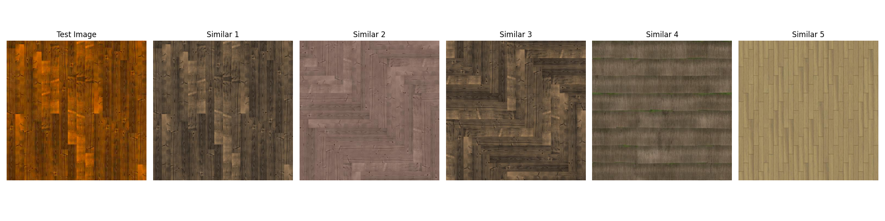

# TexturesFinder

**TexturesFinder** is a tool for fast and accurate matching in texture databases using computer vision and similarity search algorithms. Users can input a local texture or randomly select a test image, set parameters, and search for similar textures within a dataset of 220 textures. Retrieved textures can be opened directly from their local paths for further operations.

## Technical Implementation
- **Feature Extraction**: Uses [google/vit-base-patch16-224-in21k](https://huggingface.co/google/vit-base-patch16-224-in21k).
- **Dataset**: Uses [dream-textures/textures-color-normal-1k](https://huggingface.co/datasets/dream-textures/textures-color-normal-1k).
- **Similarity Search**: Employs sklearn Ball Tree algorithm with Euclidean distance for efficient nearest-neighbor retrieval.


## Getting Started

### Prerequisites
Create a Conda environment with **Python 3.12**:
```bash
conda create -n texturesfinder python=3.12
conda activate texturesfinder
```

### Installation
Install dependencies:
```bash
pip install -r requirements.txt
```

## Usage

### Launch GUI Application
Run the following command to start the front-end interface based on PyQt5. The first run will download the model from huggingface and save it in the `model/` folder.
```bash
python app.py
```


### Get Random Similarity Search Result
Without opening the front-end interface, run the following command directly:
```bash
python src/example.py
```


### Build Executable
Package into standalone EXE with PyInstaller:
```bash
pyinstaller app.spec # Outputs to `dist/` folder
```